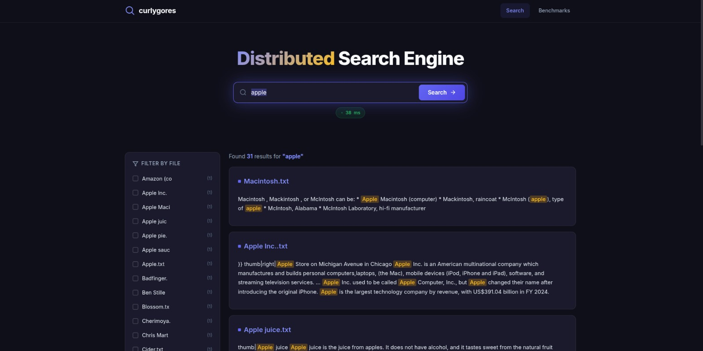
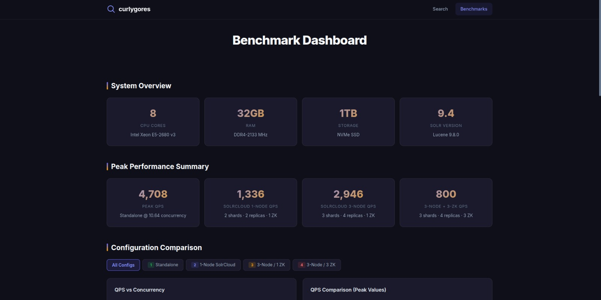
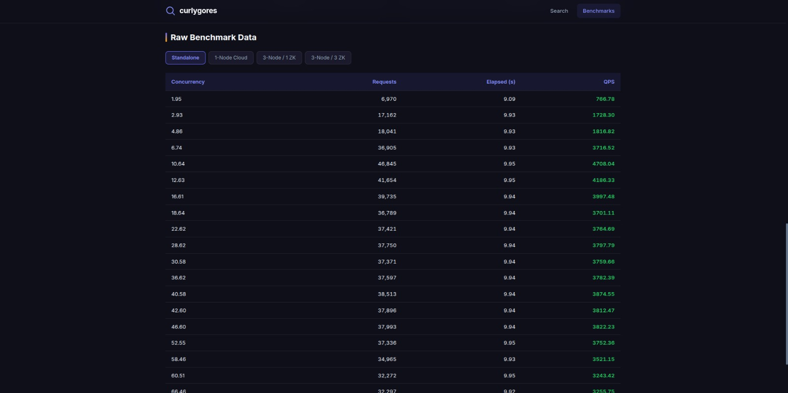
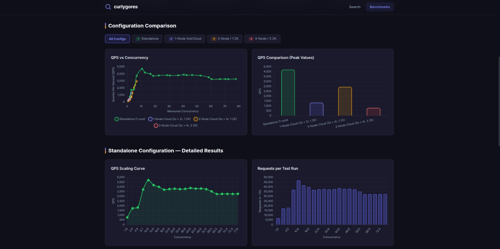

# High QPS Text Search Engine using Apache Solr and ZooKeeper

## DBMS Term Project - Complete Technical Report

---

## Table of Contents

1. [Abstract](#1-abstract)
2. [Motivation & Problem Statement](#2-motivation--problem-statement)
3. [System Architecture](#3-system-architecture)
4. [Technology Stack](#4-technology-stack)
5. [Environment Setup & Infrastructure](#5-environment-setup--infrastructure)
6. [Schema Design & Data Pipeline](#6-schema-design--data-pipeline)
7. [Search Engine Implementation](#7-search-engine-implementation)
8. [Benchmarking Infrastructure](#8-benchmarking-infrastructure)
9. [Performance Results & Analysis](#9-performance-results--analysis)
10. [Web Interface & Dashboard](#10-web-interface--dashboard)
11. [Project Structure](#11-project-structure)
12. [How to Run](#12-how-to-run)
13. [Conclusions & Key Takeaways](#13-conclusions--key-takeaways)

---

## 1. Abstract

Modern applications demand search systems capable of handling massive query volumes without degrading response quality or latency. This project designs and evaluates a scalable, high-throughput text search engine built on **Apache Solr** — an enterprise-grade search platform from the Apache Lucene project — orchestrated using **Apache ZooKeeper** for distributed coordination.

The system supports full-text keyword search across a large document corpus. To evaluate its performance under stress, we conducted systematic benchmarking using two approaches:

1. **Siege** - An HTTP load testing utility to simulate concurrent users
2. **Custom C++ multithreaded HTTP client** - leveraging `std::thread` and `libcurl` with a `ConnectionPool` abstraction

The primary outcome is a **QPS (Queries Per Second) analysis** measuring how throughput, latency, and error rates scale as concurrent request load increases. Results are visualized across four deployment configurations to highlight performance envelopes, identify bottlenecks, and demonstrate the trade-offs of distributed SolrCloud architecture versus standalone deployment on shared hardware.

---

## 2. Motivation & Problem Statement

### Why Text Search Matters

Text search is a fundamental capability in virtually every modern application — from e-commerce product discovery to document management systems, knowledge bases, and log analysis. The core challenge is not just finding relevant documents, but doing so at **scale** — handling thousands of concurrent queries with sub-millisecond latency.

### The QPS Challenge

**Queries Per Second (QPS)** is the key metric for evaluating search engine performance. As concurrent load increases, several things can happen:

- **Ideal**: QPS scales linearly with concurrency (more threads = more throughput)
- **Saturation**: QPS plateaus as CPU/memory becomes the bottleneck
- **Degradation**: QPS drops as the system becomes overwhelmed (thread contention, connection exhaustion, garbage collection pauses)

Understanding exactly where these transitions occur — and how they change across deployment configurations — is the central question this project investigates.

---

## 3. System Architecture

### 3.1 High-Level Architecture

```
                              ┌───────────────────┐
                              │   Web Frontend    │
                              │  (Search + Upload │
                              │   + Benchmark)    │
                              └────────┬──────────┘
                                       │ HTTP (REST)
                              ┌────────▼─────────┐
                              │   Apache Solr    │
                              │   (SolrCloud)    │
                              │                  │
                              │  ┌─────┐ ┌─────┐ │
                              │  │Shard│ │Shard│ │
                              │  │  1  │ │  2  │ │
                              │  └──┬──┘ └──┬──┘ │
                              │     │       │    │
                              │  ┌──▼──┐ ┌──▼──┐ │
                              │  │Rpl 1│ │Rpl 1│ │
                              │  │Rpl 2│ │Rpl 2│ │
                              │  └─────┘ └─────┘ │
                              └────────┬─────────┘
                                       │
                              ┌────────▼──────────┐
                              │  Apache ZooKeeper │
                              │  (Coordination)   │
                              │                   │
                              │  • Cluster state  │
                              │  • Leader election│
                              │  • Config mgmt    │
                              └───────────────────┘
```

### 3.2 Standalone vs SolrCloud

| Aspect | Standalone | SolrCloud |
|--------|-----------|-----------|
| **Nodes** | Single node | Multiple nodes |
| **Sharding** | No sharding | Documents distributed across shards |
| **Replication** | No replication | Each shard has multiple replicas |
| **Coordination** | None needed | ZooKeeper manages cluster state |
| **Fault Tolerance** | None | Automatic failover via replicas |
| **Query Routing** | Direct | Any node can route to correct shard |

### 3.3 How SolrCloud Query Processing Works

1. **Client sends query** to any Solr node
2. **Receiving node** becomes the **coordinator**
3. Coordinator **fans out** the query to one replica of each shard
4. Each shard **searches its local index** (Lucene)
5. Results are **merged and ranked** at the coordinator
6. **Final response** sent back to client

This introduces network overhead and coordination latency — which is why SolrCloud on a single machine can be slower than standalone, as we demonstrate in our results.

---

## 4. Tech Stack

| Technology | Version | Purpose |
|------------|---------|---------|
| **Apache Solr** | 9.3.0 | Full-text search indexing and querying (Lucene 9.8.0) |
| **Apache ZooKeeper** | 3.8.1 | Distributed cluster coordination for SolrCloud |
| **Siege** | Latest | HTTP load testing and benchmarking |
| **C++ 17** | GCC 13.3 | Custom multithreaded HTTP benchmark client |
| **libcurl** | 8.5.0 | HTTP connection pooling for C++ client |
| **Python 3** | 3.x | Visualization scripts (matplotlib) |
| **Chart.js** | 4.x | Interactive web-based benchmark charts |
| **Java** | 11+ | Solr runtime (JVM) |
| **CMake** | 3.14+ | C++ build system |

---

## 5. Environment Setup & Infrastructure

### 5.1 Prerequisites

```bash
sudo apt-get install build-essential cmake libcurl4-openssl-dev   # C++ client
sudo apt-get install default-jdk                                   # Java 11+
sudo apt-get install siege                                         # HTTP benchmarking
pip install matplotlib numpy pandas                                # Visualization
```

### 5.2 Solr & ZooKeeper Setup (`setup-solr.sh`)

The setup script automates the full infrastructure deployment:

1. **Downloads** Solr 9.3.0 and ZooKeeper 3.8.1 from Apache Archives
2. **Extracts** both packages into the project directory
3. **Configures ZooKeeper** with `zoo.cfg`
4. **Creates Solr nodes** (by default 2 nodes on ports 8983 and 8984)
5. Copies `solr.xml` (SolrCloud configuration) to each node
6. **Starts Solr in SolrCloud mode** connected to ZooKeeper at `localhost:2181`
7. **Creates the `searchcore` collection** with configurable shards and replicas

### 5.3 SolrCloud Configuration (`solr.xml`)

```xml
<solr>
  <solrcloud>
    <str name="host">${host:}</str>
    <int name="hostPort">${jetty.port:8983}</int>
    <int name="zkClientTimeout">${zkClientTimeout:30000}</int>
  </solrcloud>
  <shardHandlerFactory name="shardHandlerFactory" class="HttpShardHandlerFactory">
    <int name="socketTimeout">${socketTimeout:600000}</int>
    <int name="connTimeout">${connTimeout:60000}</int>
  </shardHandlerFactory>
</solr>
```

Key settings:
- **zkClientTimeout: 30s** — time before a node is considered dead
- **socketTimeout: 600s** — generous timeout for slow inter-shard queries
- **connTimeout: 60s** — connection establishment timeout

### 5.4 Starting Services (`start-services.sh`)
Launches zookeeper ensemble and Solr nodes

---

## 6. Schema Design & Data Pipeline

### 6.1 Solr Schema (`managed-schema.xml`)

The schema defines the document structure and text analysis pipeline:

#### Field Types

```xml
<!-- Full-text analyzed field type -->
<fieldType name="text_general" class="solr.TextField" positionIncrementGap="100">
  <!-- INDEX ANALYZER -->
  <analyzer type="index">
    <tokenizer class="solr.StandardTokenizerFactory"/>          <!-- Split on whitespace/punctuation -->
    <filter class="solr.StopFilterFactory" words="stopwords.txt" ignoreCase="true"/>  <!-- Remove: the, a, is... -->
    <filter class="solr.LowerCaseFilterFactory"/>               <!-- normalize → lowercase -->
  </analyzer>
  <!-- QUERY ANALYZER -->
  <analyzer type="query">
    <tokenizer class="solr.StandardTokenizerFactory"/>
    <filter class="solr.StopFilterFactory" words="stopwords.txt" ignoreCase="true"/>
    <filter class="solr.SynonymGraphFilterFactory" synonyms="synonyms.txt" ignoreCase="true" expand="true"/>
    <filter class="solr.LowerCaseFilterFactory"/>
  </analyzer>
</fieldType>
```

**Key design decision**: The query analyzer includes **SynonymGraphFilter** (e.g., "laptop" → "notebook", "computer") while the index analyzer does not. This is the recommended approach because:
- Index-time synonyms bloat the index size
- Query-time synonyms allow synonym updates without re-indexing

#### Fields

| Field | Type | Purpose |
|-------|------|---------|
| `id` | string | Unique document identifier |
| `title` | text_general | Document title (analyzed) |
| `content` | text_general | Full text content |
| `author` | string | Author name (exact match) |
| `category` | string (multi) | Categories for faceting |
| `tags` | string (multi) | Tags for faceting |
| `url` | string | Source URL |
| `domain` | string | Source domain |
| `last_modified` | date | Last modification timestamp |
| `text` | text_general (multi) | **Copy field** — aggregates all searchable content |

### 6.2 Solr Request Configuration (`solrconfig.xml`)

#### Search Handler (`/select`)

```xml
<requestHandler name="/select" class="solr.SearchHandler">
  <lst name="defaults">
    <str name="df">text</str>             <!-- Default search field -->
    <int name="rows">10</int>             <!-- Results per page -->
    <str name="hl">on</str>               <!-- Highlighting enabled -->
    <str name="hl.fl">title,content</str>  <!-- Highlight in title and content -->
    <str name="hl.snippets">3</str>        <!-- Max 3 highlighted fragments -->
    <str name="hl.fragsize">200</str>      <!-- Fragment size in chars -->
    <str name="facet">on</str>             <!-- Faceting enabled -->
    <str name="facet.field">category</str> <!-- Facet on category -->
    <str name="facet.field">tags</str>     <!-- Facet on tags -->
  </lst>
</requestHandler>
```

#### Auto-Suggest Handler (`/suggest`)

```xml
<searchComponent name="suggest" class="solr.SuggestComponent">
  <lst name="suggester">
    <str name="name">mySuggester</str>
    <str name="lookupImpl">FuzzyLookupFactory</str>       <!-- Fuzzy matching -->
    <str name="dictionaryImpl">DocumentDictionaryFactory</str>
    <str name="field">title</str>                          <!-- Suggest from titles -->
    <str name="suggestAnalyzerFieldType">text_general</str>
  </lst>
</searchComponent>
```

**FuzzyLookupFactory** enables typo-tolerant suggestions (e.g., "tecnology" → "Technology").

#### Index Configuration

```xml
<indexConfig>
  <ramBufferSizeMB>128</ramBufferSizeMB>    <!-- 128MB RAM buffer before flushing to disk -->
  <maxBufferedDocs>1000</maxBufferedDocs>    <!-- Max docs in memory before flushing -->
  <lockType>${solr.lock.type:native}</lockType>
</indexConfig>
```

### 6.3 Data Ingestion (`index-sample-data.sh`)

The current ingestion script builds a benchmark corpus from the **Simple English Wikipedia dump** and indexes it into Solr.

1. **Input and defaults**:
  - `SOLR_URL=http://localhost:8983/solr/searchcore`
  - `SAMPLE_COUNT=10000`
  - `CHUNK_SIZE=500`
  - `SAMPLE_FILE=downloads/wikipedia-abstracts-data.json`

2. **Dataset generation path**:
  - If `downloads/wikipedia-abstracts-data.json` does not exist, the script parses `simplewiki-latest-pages-articles.xml.bz2` via an embedded Python program.
  - It keeps only namespace `0` pages, extracts the first usable paragraph, and truncates long abstracts.
  - Each Solr document contains: `id`, `title`, `content`, `url`, `domain`, `author`, `category`, `tags`, `last_modified`, and `file_name`.
  - The resulting JSON corpus is written to `downloads/wikipedia-abstracts-data.json`.

3. **Chunking and indexing**:
  - Splits the JSON corpus into `downloads/chunks/chunkN.json` files using Python

---

## 7. Search Engine Implementation

### 7.1 Query Processing

When a user enters a search query, the frontend builds the request URL in `performSearch()` using `encodeURIComponent(currentQuery)`, `currentPage` for offset, and `ROWS_PER_PAGE` for page size (currently 10):

```bash
/solr/searchcore/select?
  q=<encoded user query>
  &start=<currentPage>
  &rows=10
  &hl=on
  &hl.fl=content,paragraph_text
  &hl.snippets=3
  &hl.fragsize=150
  &hl.simple.pre=<mark>
  &hl.simple.post=</mark>
  &hl.maxAnalyzedChars=251000
  &facet=on
  &facet.field=file_name
  &facet.mincount=1
  &facet.limit=20
  &group=true
  &group.field=file_name
  &group.limit=10
  &wt=json
```

After the fetch returns, the frontend measures end-to-end UI response time with `performance.now()` and renders grouped results by `file_name`.

### 7.2 Result Grouping

Results are **grouped by file_name** so all paragraphs from the same document appear together

### 7.3 Feature Summary

| Feature | Implementation |
|---------|---------------|
| Full-text search | Solr `text_general` field type with StandardTokenizer |
| Hit highlighting | Solr `hl` parameters with `<mark>` tags |
| Auto-suggest | FuzzyLookupFactory on title field |
| Faceted navigation | Facet on `file_name`, `category`, `tags` |
| Result grouping | `group.field=file_name` |
| Pagination | `start` and `rows` parameters |
| Response time display | `performance.now()` measurement with color indicators |

---

## 8. Benchmarking Infrastructure

### 8.1 Siege Benchmarking (`run-siege-benchmark.sh`)

**Siege** is a multi-threaded HTTP load testing and benchmarking utility. Our script:

1. **Tests prime-number concurrency levels**: 2, 3, 5, 7, 11, 13, 17, 19, 23, 29, 79, 83
   - Uses **prime numbers** for concurrency levels to avoid synchronization artifacts
   - Override with `CONCURRENT_USERS="..."`
2. **Each test runs for 10 seconds** (override with `DURATION=...`) with the `-b` (benchmark) flag (no delays between requests)
3. **Captures metrics** from siege's JSON output (siege is invoked with `-R benchmark/siege-config/siegerc`, which sets `json_output = true`; the script fails loudly if a metric can't be parsed):
   - Transactions (total requests completed)
   - Availability (% of successful requests)
   - Elapsed time
   - Response time (average)
   - Transaction rate (QPS)
   - Throughput (MB/s)
   - Concurrency (measured, not configured)
4. **Outputs JSON** for downstream visualization

**Query URL tested**:
```bash
http://localhost:8983/solr/searchcore/select?q=TCP
```

**Siege URL list** (`urls.txt`) for varied query testing:
```bash
http://localhost:8983/solr/searchcore/select?q=sample
http://localhost:8983/solr/searchcore/select?q=document
http://localhost:8983/solr/searchcore/select?q=test
http://localhost:8983/solr/searchcore/select?q=example
http://localhost:8983/solr/searchcore/select?q=author
http://localhost:8983/solr/searchcore/select?q=category
http://localhost:8983/solr/searchcore/select?q=tag
http://localhost:8983/solr/searchcore/select?q=content
http://localhost:8983/solr/searchcore/select?q=purpose
http://localhost:8983/solr/searchcore/select?q=functionality
```

### 8.2 C++ Multithreaded HTTP Client

The custom C++ benchmark client provides capabilities that Siege does not — specifically **latency percentile analysis** (p50, p95, p99), which is critical for understanding tail latency behavior.

#### Architecture

```
┌───────────────────┐
│    main.cpp       │  CLI argument parsing, config
│    (entry point)  │
└────────┬──────────┘
         │
┌────────▼─────────┐
│  BenchmarkRunner │  Orchestrates benchmark across concurrency levels
└────────┬─────────┘
         │
    ┌────┴────┐
    │         │
┌───▼────┐  ┌─▼────────────┐
│Worker  │  │ Connection   │
│threads │  │ Pool         │
│(N thds)│  │(CURL handles)│
└───┬────┘  └──────┬───────┘
    │              │
    └──────┬───────┘
           │
┌──────────▼───────────┐
│  MetricsCollector    │  Thread-safe aggregation, percentile calc
└──────────────────────┘
```

#### Worker threads (`benchmark_runner.cpp`)

Each concurrency level spawns exactly that many `std::thread` workers directly (no pool abstraction), giving precise control over the number of concurrent threads:

```cpp
std::vector<std::thread> workers;
for (int t = 0; t < concurrency_level; ++t) {
    workers.emplace_back([&]() {
        while (running.load()) {
            CURL* handle = conn_pool.acquire();   // shared ConnectionPool
            RequestResult r = execute_query(handle, url);
            conn_pool.release(handle);
            collector.record(r);
        }
    });
}
```

**Synchronization**: A `std::atomic<bool> running` flag signals all workers to stop after the duration elapses; the main thread then `join()`s every worker. Connection handoff is serialized by the `ConnectionPool`'s mutex/condition variable.

#### ConnectionPool (`connection_pool.hpp/cpp`)

Pre-initialized pool of CURL easy handles:

```cpp
class ConnectionPool {
    std::queue<CURL*> available_;     // Available handles
    std::mutex mutex_;                // Thread safety
    std::condition_variable condition_; // Block until handle available
};
```

**Key optimizations**:
- **TCP Keep-Alive**: Reuses TCP connections across requests
- **DNS Caching**: 300-second DNS cache timeout avoids repeated DNS lookups
- **HTTP/1.1**: Explicit keep-alive to prevent connection teardown
- **CURLOPT_NOSIGNAL**: Required for thread safety (disables signals)

#### MetricsCollector (`metrics.hpp/cpp`)

Thread-safe aggregation of per-request results:

```cpp
struct RequestResult {
    double latency_ms;     // Measured with std::chrono::high_resolution_clock
    int http_status;       // HTTP status code
    bool success;          // true if 2xx
    size_t response_bytes; // Response body size
};
```

**Percentile computation** uses sorted latency arrays with linear interpolation:

```cpp
// p50 = median, p95 = 95th percentile, p99 = 99th percentile
double index = (p / 100.0) * (sorted_data.size() - 1);
size_t lower = floor(index);
size_t upper = ceil(index);
return sorted_data[lower] * (1 - fraction) + sorted_data[upper] * fraction;
```

**Measured concurrency** is computed via **Little's Law**:
```
L = λ × W
```
Where L is concurrency, λ is throughput (QPS), and W is average latency.

#### Usage

```bash
# Build
cd benchmark && mkdir build && cd build
cmake .. -DCMAKE_BUILD_TYPE=Release
make -j$(nproc)

# Run
./solr_benchmark \
  --url http://localhost:8983/solr/searchcore \
  --concurrency 2,5,10,25,50,100 \
  --duration 10 \
  --output results.json
```

#### JSON Output (Siege-Compatible + Percentiles)

```json
{
  "benchmark_timestamp": "2025-05-03T10:30:00Z",
  "solr_url": "http://localhost:8983/solr/searchcore",
  "benchmark_tool": "cpp_multithreaded_client",
  "results": [
    {
      "concurrent_users": 10,
      "transactions": 45000,
      "availability": 100.00,
      "transaction_rate": 4495.50,
      "concurrency": 9.87,
      "p50_latency_ms": 1.23,
      "p95_latency_ms": 3.45,
      "p99_latency_ms": 8.76
    }
  ]
}
```

### 8.3 Visualization Pipeline

#### `visualize.py`
Processes siege JSON results → generates matplotlib charts:
- QPS vs Concurrency
- Response time vs Concurrency
- Throughput analysis

#### `compare_configs.py`
Generates multi-configuration comparison charts from the raw benchmark data:
- All 4 configs overlaid on a single QPS chart
- Peak QPS bar comparison
- Standalone scaling curve with annotated peak

#### `add_to_website.py`
Injects benchmark results into the web dashboard's HTML.

---

## 9. Performance Results & Analysis

### 9.1 Test Configurations

Four configurations were benchmarked on the **same hardware**:

| Config # | Description | Nodes | Cores | Shards | Replicas | ZooKeeper |
|----------|-------------|-------|-------|--------|----------|-----------|
| 1 | **Standalone** | 1 | 1 | — | — | — |
| 2 | **SolrCloud (Small)** | 1 | 4 | 2 | 2 | 1 |
| 3 | **SolrCloud (Large)** | 3 | 12 | 3 | 4 | 1 |
| 4 | **SolrCloud (Full HA)** | 3 | 12 | 3 | 4 | 3 |

**Test methodology**: Each concurrency level runs for ~10 seconds. Siege sends continuous requests with no inter-request delay (`-b` benchmark mode). Measured concurrency captures the actual system behavior, not the configured thread count.

### 9.2 Configuration 1: Standalone (1 Core)

| Concurrency | Requests | Elapsed (s) | QPS |
|-------------|----------|-------------|------|
| 1.95 | 6,970 | 9.09 | 766.78 |
| 2.93 | 17,162 | 9.93 | 1,728.30 |
| 4.86 | 18,041 | 9.93 | 1,816.82 |
| 6.74 | 36,905 | 9.93 | 3,716.52 |
| **10.64** | **46,845** | 9.95 | **4,708.04** ← Peak |
| 12.63 | 41,654 | 9.95 | 4,186.33 |
| 16.61 | 39,735 | 9.94 | 3,997.48 |
| 22.62 | 37,421 | 9.94 | 3,764.69 |
| 40.58 | 38,513 | 9.94 | 3,874.55 |
| 58.46 | 34,965 | 9.93 | 3,521.15 |
| 77.94 | 32,410 | 9.93 | 3,263.85 |

**Analysis**:
- **Peak at 4,708 QPS** with only ~11 concurrent users
- **Linear scaling zone**: 2 → 11 concurrency (QPS increases proportionally)
- **Plateau zone**: 11 → 50 concurrency (QPS stabilizes ~3,800)
- **Gradual degradation**: 50+ concurrency (QPS slowly declines to ~3,200)
- **No failures** — 100% availability across all levels

### 9.3 Configuration 2: 1-Node SolrCloud (2 Shards × 2 Replicas, 1 ZK)

| Concurrency | Requests | Elapsed (s) | QPS |
|-------------|----------|-------------|------|
| 1.94 | 4,989 | 9.71 | 513.80 |
| **2.90** | **13,308** | 9.96 | **1,336.14** ← Peak |
| 0.76 | 2,586 | 9.96 | 259.64 |

**Analysis**:
- **Peak QPS: 1,336** — 71.6% slower than standalone
- **Collapsed at concurrency 3+** — system became unresponsive
- ZooKeeper coordination + 4 cores competing on the same CPU caused severe contention

### 9.4 Configuration 3: 3-Node SolrCloud (3 Shards × 4 Replicas, 1 ZK)

| Concurrency | Requests | Elapsed (s) | QPS |
|-------------|----------|-------------|------|
| 1.97 | 3,371 | 9.43 | 357.48 |
| 2.92 | 6,458 | 9.95 | 649.05 |
| 4.83 | 20,543 | 9.95 | 2,064.62 |
| **6.75** | **29,345** | 9.96 | **2,946.29** ← Peak |
| 5.58 | 23,721 | 9.96 | 2,381.63 |
| 0.58 | 1,468 | 9.96 | 147.39 |

**Analysis**:
- **Peak QPS: 2,946** — better than Config 2, but still 37.4% slower than standalone
- **Higher initial scaling gradient** than Config 1 (2→7 concurrency)
- **Severe instability** — performance fluctuates wildly after peak
- Multiple data points show near-zero QPS, indicating system-level failures

### 9.5 Configuration 4: 3-Node SolrCloud (3 Shards × 4 Replicas, 3 ZK)

| Concurrency | Requests | Elapsed (s) | QPS |
|-------------|----------|-------------|------|
| 1.96 | 3,230 | 9.61 | 336.11 |
| **2.94** | **7,597** | 9.95 | **763.52** |
| 2.45 | 7,955 | 9.94 | **800.30** ← Peak |
| 1.3 | 3,930 | 9.94 | 395.37 |
| 2.03 | 6,682 | 9.94 | 672.23 |
| 1.76 | 4,772 | 9.94 | 480.08 |

**Analysis**:
- **Peak QPS: 800** — worst performing configuration
- 3 ZooKeeper nodes on the same machine cause **quorum overhead** (ZAB protocol)
- The ZK ensemble constantly syncs state across 3 processes, consuming CPU/memory

### 9.6 Cross-Configuration Comparison

```
Peak QPS Comparison:

Standalone    ████████████████████████████████████████████████  4,708 QPS
3N/1ZK Cloud  ████████████████████████████████                  2,946 QPS
1N/1ZK Cloud  ██████████████                                    1,336 QPS
3N/3ZK Cloud  ████████                                            800 QPS
```

---

## 10. Web Interface & Dashboard

### 10.1 Search Interface (`index.html`)



### 10.2 Benchmark Dashboard (`benchmark.html`)

Interactive dashboard built with Chart.js displaying:

- **System Overview Cards**: CPU, RAM, Storage, Solr version
- **Peak Performance Cards**: Peak QPS for all 4 configurations
- **Interactive Charts**:
  - QPS vs Concurrency (all configs overlaid, with toggle buttons)
  - Peak QPS bar comparison
  - Standalone scaling curve
  - Requests per test run
- **Tabbed Data Tables**: Raw data for each configuration
- **Key Findings Section**: Analysis insights with bullet points







---

## 11. Project Structure

```
distributed-search-engine/
├── PROJECT_REPORT.md                      ← This file
├── README.md                              ← General overview
│
├── benchmark/                             ← C++ Multithreaded HTTP Client
│   ├── CMakeLists.txt                     ← CMake build system
│   ├── README.md                          ← Build/usage documentation
│   ├── include/
│   │   ├── connection_pool.hpp            ← ConnectionPool (libcurl)
│   │   ├── metrics.hpp                    ← Metrics + percentiles
│   │   └── benchmark_runner.hpp           ← Benchmark orchestrator
│   ├── src/
│   │   ├── main.cpp                       ← CLI entry point
│   │   ├── connection_pool.cpp            ← ConnectionPool implementation
│   │   ├── metrics.cpp                    ← p50/p95/p99 computation
│   │   └── benchmark_runner.cpp           ← Multi-level benchmark (std::thread workers)
│   └── build/
│       └── solr_benchmark                 ← Compiled binary
│
├── solr-apache/
│   └── scripts/
│       ├── env.sh                         ← Shared config (collection, ports, URLs)
│       ├── setup-solr.sh                  ← Downloads + configures Solr & ZK
│       ├── start-services.sh              ← Starts ZK + Solr nodes, uploads configset
│       ├── index-sample-data.sh           ← Generates + indexes 10K docs
│       ├── run-siege-benchmark.sh         ← Automated siege benchmarking
│       ├── finalize-benchmark.sh          ← Full benchmark + report
│       ├── visualize.py                   ← Matplotlib chart generation
│       ├── compare_configs.py             ← Multi-config charts (reads configs.json)
│       ├── add_to_website.py              ← Injects results into benchmark.html
│       ├── sync_dashboard_data.py         ← Syncs dashboard CONFIGS from configs.json
│       ├── solr-config/
│       │   ├── solr.xml                   ← SolrCloud config
│       │   ├── zoo.cfg                    ← ZooKeeper config
│       │   └── searchcore/
│       │       ├── core.properties        ← Core registration
│       │       └── conf/
│       │           ├── managed-schema.xml ← Schema (fields, analyzers)
│       │           ├── solrconfig.xml     ← Handlers, highlighting, facets
│       │           ├── stopwords.txt      ← Stop words list
│       │           └── synonyms.txt       ← Synonym mappings
│       └── benchmark/
│           └── siege-config/
│               ├── urls.txt               ← Siege query URL list
│               └── siegerc                ← siege rc (enables JSON output)
│
│   └── webapp/
│       ├── index.html                     ← Search interface
│       ├── benchmark.html                 ← Benchmark dashboard (Chart.js)
│       ├── server.py                      ← Static server + Solr proxy
│       ├── css/style.css                  ← Dark theme + glassmorphism
│       ├── js/app.js                      ← Search, upload, suggestions
│       ├── data/
│       │   └── configs.json               ← Canonical benchmark dataset (source of truth)
│       ├── images/                        ← Screenshots (charts are gitignored)
│       └── notes.txt                      ← Raw benchmark data table
```

---

## 12. How to Run

### Step 1: Set Up Infrastructure

```bash
cd solr-apache/scripts
./setup-solr.sh        # Downloads Solr 9.3.0 + ZooKeeper 3.8.1
./start-services.sh    # Starts ZK + 2 Solr nodes
```

### Step 2: Index Sample Data

```bash
./index-sample-data.sh   # Generates + indexes 10,000 documents
```
### Step 3: Start the backend proxy server
```bash
cd ..
python3 webapp/server.py
```

### Step 4: Open Search Interface

Open in browser:
```
file:///path/to/distributed-search-engine/solr-apache/webapp/index.html
```

Or with Solr running, access Solr Admin:
```
http://localhost:8983/solr/
```

### Step 5: Run Siege Benchmarks

```bash
./scripts/run-siege-benchmark.sh
```

### Step 6: Build & Run C++ Benchmark Client

```bash
cd ../benchmark
mkdir build && cd build
cmake .. -DCMAKE_BUILD_TYPE=Release
make -j$(nproc)

./solr_benchmark \
  --url http://localhost:8983/solr/searchcore \
  --concurrency 2,5,10,25,50 \
  --duration 10 \
  --output results.json
```

### Step 7: Generate Comparison Charts

```bash
cd ../solr-apache/scripts
python3 compare_configs.py
```

The dashboard's data comes from `webapp/data/configs.json`. If you edit that file,
run `python3 sync_dashboard_data.py` to regenerate the dashboard's inline data.

### Step 8: View Benchmark Dashboard

Open in browser:
```
file:///path/to/distributed-search-engine/solr-apache/webapp/benchmark.html
```


# Cleanup: 

## Safely shutdown the UI backend
```
fuser -k 9090/tcp
```

## Broadcast the shutdown signal to the entire Solr and Jetty network
```
/home/$USER/dbms-term-project/solr-apache/scripts/solr-nodes/node1/bin/solr stop -all
```

## Terminate the ZooKeeper orchestrators
```
cd /home/$USER/dbms-term-project/solr-apache/scripts/zookeeper
./bin/zkServer.sh stop conf/zoo1.cfg
./bin/zkServer.sh stop conf/zoo2.cfg
./bin/zkServer.sh stop conf/zoo3.cfg
```
---

## 13. Conclusions & Key Takeaways

### Performance Conclusions

1. **Standalone Solr achieves remarkable single-node performance** — 4,708 QPS on commodity hardware demonstrates Lucene's efficiency as a search engine core.

2. **SolrCloud's value is in horizontal scaling and fault tolerance, not single-machine performance** — all distributed configurations showed lower peak QPS when co-located on one host.

3. **ZooKeeper coordination overhead is non-trivial** — the ZAB consensus protocol for leader election, state synchronization, and configuration management adds measurable latency to every query path.

4. **Connection pooling and thread management are critical** — our C++ benchmark client demonstrates that proper connection reuse (via TCP keep-alive and CURL handle pooling) and thread synchronization (via mutex + condition variable) are essential for achieving high throughput.

5. **Latency percentiles reveal more than averages** — p95 and p99 latencies expose tail behavior that average response time hides. A system with 2ms average but 200ms p99 has very different characteristics than one with 5ms average and 8ms p99.

### Technical Contributions

- **Complete C++ benchmark client** with `std::thread` workers, a `ConnectionPool`, and percentile-based metrics — providing capabilities beyond Siege
- **Multi-configuration comparison framework** with automated chart generation
- **Premium web interface** with PDF/text upload, paragraph-level search, and interactive benchmark dashboard
- **End-to-end automation** from infrastructure setup through benchmarking to visualization